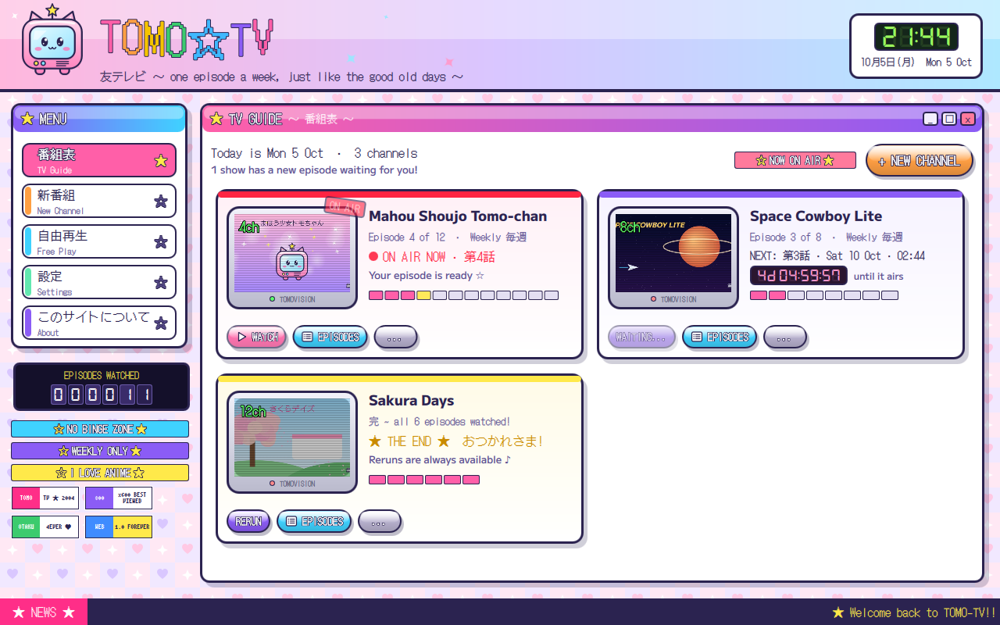
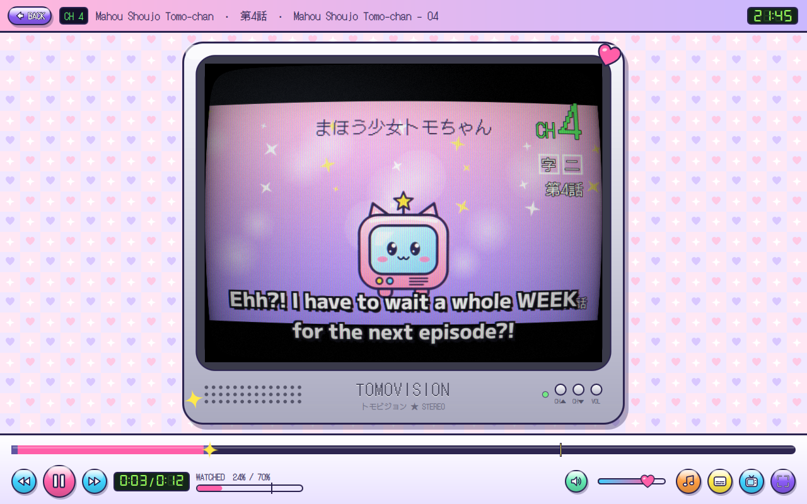
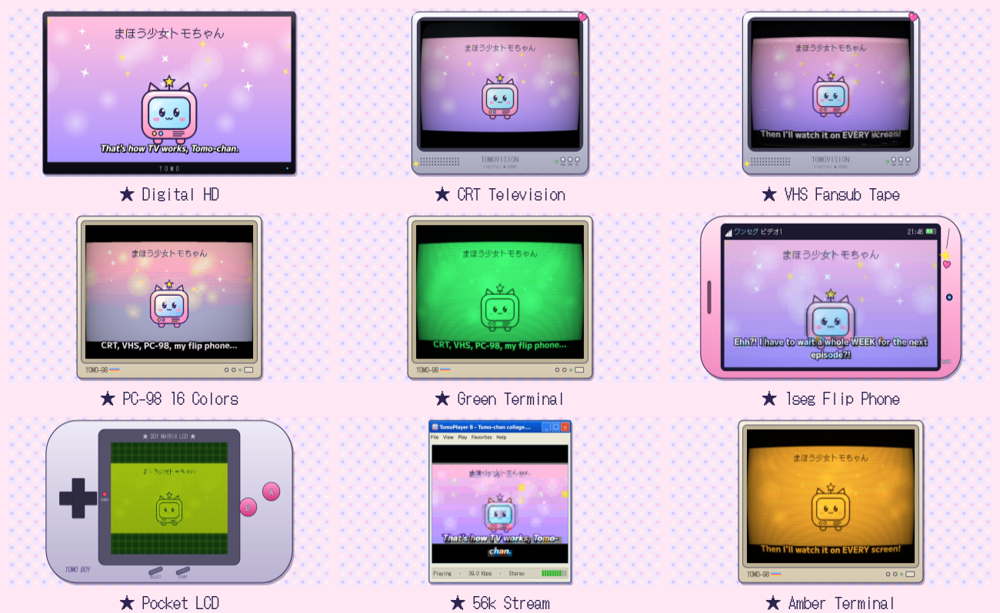

# TOMO☆TV ～友テレビ～

A 2000s otaku-styled video player that **airs your anime one episode a week**, like real TV.
No binge-watching allowed (｀・ω・´)



## What it does

### 📺 TV mode (the main thing)

1. Pick a folder with one season of a show. TOMO-TV finds the episodes, puts them in order,
   skips extras like NCOP/NCED, and checks which **audio tracks** (Japanese, English dub...) and
   **subtitles** (built into the video or separate `.ass` / `.srt` / `.vtt` files) are there.
2. Press **START BROADCAST**. Episode 1 airs right away.
3. After that, **one new episode airs every week**, at the same time as the premiere.
4. You have to **watch in order**, and an episode only counts once you've really watched
   **70% of it**. Skipping ahead doesn't count, but skipping the opening is fine.
5. Missed a few weeks? The aired episodes pile up, but you still go one by one.

Each show is a "channel" with its own number, so you can have a whole season of shows going at once.
Watched episodes can always be re-run.

### 🖥️ Screen emulation (optional)

Watch on any of these, with the right resolution, shape and device around the picture:

| Mode | What it looks like |
| --- | --- |
| Digital HD | A shiny 2005 flat-screen, clean picture |
| CRT Television | Curved glass, scanlines, glow, 4:3 |
| VHS Fansub Tape | Smeared colors, wobble, tracking noise, tape counter |
| PC-98 16 Colors | 640×400, sixteen colors, dithered like a visual novel |
| Green / Amber Terminal | Monochrome phosphor monitor |
| 1seg Flip Phone | Mobile TV on a 2006 flip phone at 15 fps |
| Pocket LCD | Four shades of handheld-console green |
| 56k Stream | Blocky dial-up streaming in a 2001 media player window |

You can also choose the **signal resolution** (1080p down to 144p), the **screen shape**
(4:3, 16:9, 16:10) and how the picture fits (**letterbox, stretch, or zoom**).




### ▶️ Free play

Open (or drag in) any video and watch it normally, with all the screen modes.

## How to run it

You need a computer with Windows, macOS or Linux, and an internet connection for the first start.

### Windows, the easy way (nothing to install)

1. Go to the [latest release](https://github.com/Tomasz-programista/Tomo/releases/latest)
   and download **TomoTV-windows.zip**.
2. Unzip it (right-click → *Extract All…*), open the `TomoTV` folder and double-click **TomoTV.exe**.

If Windows says "Windows protected your PC", click **More info**, then **Run anyway**
(the app isn't signed with a paid certificate). The zip is rebuilt automatically every time the
code changes; your channels are saved in your user folder, so you can swap in a new version any time.

### Windows, from the source code

1. Install **Python 3.14** from <https://www.python.org/downloads/windows/>
   (the "Windows installer (64-bit)"). In the installer, tick **"Add python.exe to PATH"**.
   Python 3.10 to 3.14 all work; 3.15 doesn't yet.
2. Download TOMO-TV: on the GitHub page, click the green **Code** button, then **Download ZIP**,
   and unzip it somewhere (like your Documents folder).
3. Double-click **`run_windows.bat`**.
   The first time, it downloads the video engine (about 300 MB) and takes a few minutes.
   After that it starts right away.

If Windows says "Windows protected your PC", click **More info**, then **Run anyway**.
If something goes wrong, double-click `debug_windows.bat` to see the error messages.

### macOS

1. Install **Python 3.14** from <https://www.python.org/downloads/macos/>.
2. Download the ZIP as above and unzip it.
3. Right-click **`run_mac.command`** and choose **Open** (macOS asks the first time).
   Or open Terminal in the folder and run `bash run_mac.command`.

### Linux

```bash
sudo apt install python3 python3-venv libxcb-cursor0   # Ubuntu / Debian
./run_linux.sh
```

## Using it

- **New Channel** in the menu: pick a season folder, check the episode order, choose audio and
  subtitles, choose how often it airs (weekly is the real deal), then **START BROADCAST**.
- **TV Guide**: every channel, what's on air, and a countdown to the next episode.
- **Free Play**: play any video file.

Keys in the player:

| Key | Does |
| --- | --- |
| Space | play / pause |
| ← → | back / forward 10 seconds |
| ↑ ↓ | volume |
| M | mute |
| F | fullscreen |
| A | switch audio track (主音声 / 副音声) |
| S | switch subtitles |
| V | next screen mode (Shift+V goes back) |
| I | show the channel info |
| Esc | leave fullscreen / back to the guide |

Your channels and progress are saved in your user folder (Settings shows exactly where).
Your video files are never changed or moved. If you move a show's folder (or a USB drive gets a
new letter), use **… → Change folder** on its channel.

## Good to know

- Text subtitles (ASS/SSA, SRT, WebVTT), built in or as separate files next to the episodes, work.
  Picture-based subtitles from Blu-ray/DVD rips (PGS, VobSub) can't be shown.
- Fancy ASS typesetting (moving signs, karaoke effects) is shown as plain text.
- Video plays through Qt Multimedia's FFmpeg engine, so MKV, MP4, AVI, H.264 (including 10-bit),
  HEVC, AAC, FLAC, AC3, DTS, Opus and friends all work.
- The weekly schedule follows your computer's clock. Episodes that already aired stay aired even
  if the clock goes backwards. Yes, you could cheat by changing the clock, but then what was the point?

## For developers

```bash
python -m venv .venv && .venv/bin/pip install -r requirements.txt
.venv/bin/python tomotv.py
python -m unittest discover -s tests -t .      # schedule, 70% rule, folder scanning, subtitles
```

- `tomotv/` is the Python side: `schedule.py` (airing rules), `watch.py` (the 70% tracker),
  `library.py` (finding episodes and subtitle files), `station.py` (channels, saving),
  `backend.py` (the bridge to the interface), `media.py` (subtitle relay, track probing).
- `qml/` is the interface. `qml/screen/` has the screen emulator and device frames.
- `shaders/src/` holds the screen effects. After editing one, run `python tools/build_shaders.py`.
- `tools/make_assets.py` regenerates the icon PNGs and the chiptune UI sounds.
- `packaging/tomotv.spec` is the PyInstaller recipe for the Windows app
  (`pip install pyinstaller` then `pyinstaller packaging/tomotv.spec`). GitHub Actions builds it in
  `.github/workflows/build-windows.yml`, checks it with `TomoTV --smoke-test tests/data/sample.mkv`
  (starts, plays the clip, checks subtitles, exits 0 if all is well) and publishes the release.
- For testing, `TOMOTV_TIME_OFFSET_DAYS=7` pretends a week has passed. Use it together with
  `TOMOTV_DATA_DIR=some/test/folder`, because time travel sticks: aired episodes stay aired.

Fonts: DotGothic16, M PLUS 1 and DSEG (SIL Open Font License) and Misaki Gothic (free license);
see `assets/fonts/licenses/`.
